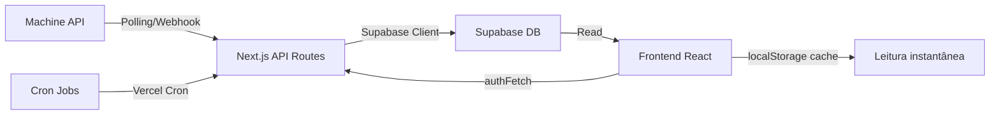

# 📊 Relatório de Análise — Plataforma LogiPay (Expresso Neves)

> **Data:** 25/04/2026 | **Versão analisada:** 0.1.0 (Fase 1)

---

## 1. Visão Geral

A plataforma é um **SaaS multi-tenant de gestão financeira logística** para empresas que operam com motoboys (entregadores). Consolida dados de corridas de uma API externa (Taxi Machine), gerencia lançamentos manuais (diárias, extras, adiantamentos) e gera relatórios financeiros semanais para liquidação.

| Aspecto | Detalhe |
|---------|---------|
| **Stack** | Next.js 16 + React 19 + Supabase + TypeScript |
| **Deploy** | Vercel (com cron jobs) |
| **API Externa** | Taxi Machine (`api.taximachine.com.br`) |
| **Auth** | Basic Auth (middleware) + Supabase DB lookup |
| **Mapa** | Leaflet / React-Leaflet |
| **Validação** | Zod v4 |
| **CSS** | Vanilla CSS (Design System próprio "LogiPay Operations Hub") |

---

## 2. Arquitetura do Sistema

### 2.1 Estrutura de Diretórios

```
platform/
├── app/
│   ├── (dashboard)/        # 11 páginas protegidas (route groups)
│   │   ├── page.tsx         # Dashboard principal (30KB!)
│   │   ├── corridas/        # Histórico de corridas
│   │   ├── lancamentos/     # Grid semanal de presença/diárias
│   │   ├── relatorios/      # Relatório semanal por motoboy
│   │   ├── financeiro/      # Crédito automático + saldos
│   │   ├── snapshots/       # Fechamento semanal
│   │   ├── configuracoes/   # Taxas, diárias, turnos
│   │   ├── motoboys/        # Gestão de condutores (admin)
│   │   ├── empresas/        # Gestão de lojas (admin)
│   │   ├── escala/          # Escalas de trabalho (72KB!)
│   │   ├── sync/            # Logs de sincronização (admin)
│   │   └── usuarios/        # Gestão de usuários
│   ├── api/                 # ~47 API routes
│   │   ├── auth/            # Login/registro
│   │   ├── cron/            # auto-credit, auto-noshow, sync-rides
│   │   ├── db/              # CRUD Supabase (entries, snapshots, configs...)
│   │   ├── machine/         # Proxy para Machine API (8 endpoints)
│   │   ├── webhook/         # Callbacks Machine (posição, status, registro)
│   │   ├── schedules/       # Escalas + confirmação
│   │   ├── supervisor/      # Endpoints do supervisor
│   │   └── nola/            # Abertura de solicitação
│   ├── components/          # 12 componentes reutilizáveis
│   ├── context/             # AppContext (empresa, semana, auth)
│   ├── hooks/               # 2 hooks (realtime, sync)
│   ├── services/            # 4 stores (entries, snapshots, config, export)
│   └── lib/                 # api-client, date-utils, evolution-go, status-map
├── lib/
│   ├── engine/              # WeeklyRulesEngine (motor de cálculo)
│   ├── supabase/            # Client + resolve-tenant + browser-singleton
│   ├── machine/             # Machine API wrapper
│   ├── types/               # TypeScript types (database + domínio)
│   └── validations/         # Schemas Zod
├── middleware.ts             # Auth guard para API routes
└── migrations/               # SQL migrations
```

### 2.2 Fluxo de Dados



### 2.3 Modelo Multi-Tenant

- **Admin Central** → Acesso total via `MACHINE_USERNAME` (env var)
- **Lojista/Manager** → Filtrado por `company_id` via RLS + `user_companies`
- **Supervisor/Coordinator** → Restrito à tela `/escala`
- **Segurança** → Headers `X-User-Role`/`X-Tenant-Id` são **hints**, role real validado no DB

---

## 3. Banco de Dados (14 tabelas)

| Tabela | Propósito |
|--------|-----------|
| `companies` | Lojas/empresas cadastradas |
| `company_configs` | Configurações financeiras por empresa |
| `drivers` | Condutores/motoboys |
| `company_drivers` | Vínculo N:N empresa↔motorista |
| `users` | Usuários do sistema |
| `rides` | Corridas sincronizadas da Machine |
| `manual_entries` | Diárias, extras, adiantamentos |
| `driver_default_rates` | Diárias pré-configuradas por motorista |
| `financial_snapshots` | Fotografias financeiras semanais |
| `financial_line_items` | Detalhamento por motorista/dia |
| `credit_log` | Registro de créditos/débitos |
| `snapshot_drivers` | Dados por motorista no snapshot |
| `sync_logs` | Auditoria de sincronizações |
| `system_config` | Configurações globais do sistema |

---

## 4. Motor de Cálculo (Rules Engine)

O `WeeklyRulesEngine` implementa **dois modos simultâneos**:

| Modo | Fórmula |
|------|---------|
| **Produção** | `Diária + max(0, Produção - Diária) + TxCorridas - Adiantamentos` |
| **Garantida** | `max(Produção + Extras, Diária) + TxCorridas - Adiantamentos` |

> [!IMPORTANT]
> O motor opera exclusivamente sobre **dias úteis** (`isWeekend()` filtra sáb/dom), mas a interface exibe os 7 dias. Há um suporte a **turnos fracionados** e **faixas por horas** (modo `garantida_horas`) nas configs.

---

## 5. Pontos Fortes ✅

1. **Documentação de regras de negócio** — O `regras_negocios.md` (546 linhas) é excelente e cobre todo o domínio
2. **Segurança do tenant** — `resolve-tenant.ts` implementa validação rigorosa (DB, não headers)
3. **Design System maduro** — 2.468 linhas de CSS com tokens, responsivo, dark sidebar, premium
4. **Motor de cálculo sólido** — `WeeklyRulesEngine` é limpo, tipado e com dois modos
5. **Integração Machine completa** — 16+ endpoints Machine já integrados
6. **Security headers** — CSRF, XSS, clickjacking, no-cache em API routes
7. **Multi-company support** — `user_companies` junction table para multi-tenant
8. **Padrão write-through** — Writes vão para Supabase primeiro, cache localStorage secundário
9. **Cron jobs** — `sync-rides`, `auto-credit`, `auto-noshow` automatizados
10. **Upgrade roadmap** — `Upgrade_Sistema.md` bem planejado com 4 fases

---

## 6. Riscos e Dívidas Técnicas 🔴

### 6.1 CRÍTICO — Arquivos Monolíticos

| Arquivo | Tamanho | Problema |
|---------|---------|----------|
| `escala/page.tsx` | **72 KB** | Página monolítica enorme — impossível de manter |
| `page.tsx` (dashboard) | **30 KB** | Dashboard principal muito grande |
| `NewDeliveryModal.tsx` | **42 KB** | Modal único com toda a lógica |
| `globals.css` | **69 KB** | CSS monolítico — deveria ser modularizado |

> [!CAUTION]
> Arquivos acima de 20KB em React são um anti-pattern grave. Dificultam code review, testes, e aumentam riscos de regressão.

### 6.2 CRÍTICO — localStorage como Cache Principal

Os 3 stores principais (`entries-store`, `snapshot-store`, `company-config`) usam **localStorage como camada de leitura primária**:

- ❌ Dados perdidos ao limpar navegador
- ❌ Sem sincronização entre abas/dispositivos
- ❌ Limite de 5-10MB do localStorage
- ❌ Race conditions com múltiplos usuários

> O `regras_negocios.md` confirma: *"Persistência atual: localStorage (migração para Supabase planejada)"*

### 6.3 ALTO — Sem Testes Automatizados

- ❌ Zero arquivos `*.test.ts` ou `*.spec.ts` encontrados
- ❌ Sem configuração de Jest/Vitest
- ❌ O `WeeklyRulesEngine` (lógica financeira crítica) não tem testes unitários

### 6.4 ALTO — Autenticação via Basic Auth

- ❌ Credenciais trafegam em Base64 (não criptografadas) em cada request
- ❌ Sessão armazenada em localStorage (XSS = roubo completo)
- ❌ Sem CSRF token, sem refresh token, sem expiração server-side
- A expiração de 24h é client-side apenas

### 6.5 MÉDIO — Cron Job Único

```json
// vercel.json
{ "crons": [{ "path": "/api/cron/sync-rides", "schedule": "0 6 * * *" }] }
```

- Apenas `sync-rides` está agendado (1x/dia às 6h)
- `auto-credit` e `auto-noshow` existem mas **não estão no cron**

### 6.6 MÉDIO — Sem Rate Limiting no Frontend

- O `rate-limiter.ts` existe na lib mas não há proteção contra abuso nas API routes públicas
- Sem throttle/debounce em chamadas frequentes do frontend

### 6.7 BAIXO — `.env.local` no Repositório

O `.env.local` (1.1KB) está presente no diretório. Mesmo com `.gitignore`, é um risco se o git não estiver configurado corretamente.

---

## 7. Análise de Segurança

| Aspecto | Status | Nota |
|---------|--------|------|
| Auth middleware | ✅ | Valida formato Basic Auth |
| Tenant isolation | ✅ | DB-validated, não header-based |
| RLS (Supabase) | ⚠️ | Schema define RLS mas sem token Supabase para verificar |
| HMAC webhooks | ✅ | `webhook-hmac.ts` implementado |
| Security headers | ✅ | X-Frame-Options, HSTS-like, Permissions-Policy |
| Session storage | ❌ | localStorage vulnerável a XSS |
| Password hashing | ❓ | Não encontrado no código — verificar se Supabase Auth gerencia |
| CORS | ⚠️ | Não configurado explicitamente |
| Input validation | ✅ | Zod v4 presente |

---

## 8. Métricas do Projeto

| Métrica | Valor |
|---------|-------|
| Páginas do dashboard | 11 |
| API routes | ~47 |
| Componentes compartilhados | 12 |
| Tabelas no banco | 14 |
| Linhas de CSS | 2.468 |
| Linhas de regras de negócio | 546 |
| Endpoints Machine integrados | 16+ |
| Testes automatizados | **0** |
| Dependências de produção | 10 |
| Dependências de dev | 6 |

---

## 9. Perguntas Estratégicas

> [!IMPORTANT]
> As respostas a estas perguntas vão definir as próximas ações na plataforma.

### Sobre o Estado Atual
1. **A plataforma está em produção?** Há lojas/empresas reais usando o sistema hoje?
2. **Quantas empresas e motoboys estão cadastrados?** Qual o volume de corridas diárias?
3. **O Supabase MCP não está conectado** (erro de token). Você quer configurar o token para eu poder auditar o banco diretamente?

### Sobre Prioridades
4. **A migração de localStorage → Supabase como source of truth** é a prioridade #1? Ou há algo mais urgente?
5. **O `Upgrade_Sistema.md` (Fase 1: PDF/Excel + Cadastro Motoboy + Histórico)** ainda é o roadmap atual? As prioridades mudaram?
6. **Os cron jobs `auto-credit` e `auto-noshow`** deveriam estar agendados no Vercel? Estão sendo invocados de outra forma?

### Sobre Qualidade
7. **Deseja implementar testes automatizados?** O Rules Engine é o candidato #1 para cobertura.
8. **Os arquivos monolíticos (escala 72KB, dashboard 30KB)** estão causando problemas de manutenção? Quer priorizarmos a refatoração?
9. **A autenticação Basic Auth é intencional para a fase atual**, ou há planos de migrar para JWT/OAuth?

### Sobre Funcionalidades
10. **O módulo de Escalas (`/escala`)** parece ser o mais desenvolvido recentemente (72KB). Está funcional e em uso?
11. **O `evolution-go.ts` (8KB na app/lib)** parece ser uma integração com WhatsApp/Evolution API. Está ativa?
12. **Qual é o próximo recurso que você precisa implementar?**

---

## 10. Recomendações Priorizadas

### 🔴 Urgente (impacto em produção)
1. **Migrar localStorage → Supabase reads** — Eliminar risco de perda de dados
2. **Agendar crons faltantes** — `auto-credit` e `auto-noshow` no `vercel.json`
3. **Remover `.env.local` do diretório** (verificar `.gitignore`)

### 🟡 Importante (qualidade e manutenibilidade)
4. **Testes unitários para Rules Engine** — Lógica financeira precisa de cobertura
5. **Refatorar componentes monolíticos** — Escala (72KB) e Dashboard (30KB) em sub-componentes
6. **Modularizar CSS** — Extrair `globals.css` em CSS Modules por componente

### 🟢 Melhorias (diferencial competitivo)
7. **Exportação PDF/Excel** — Feature #1 do roadmap (Fase 1)
8. **Dashboard gerencial** — Visão macro para a central
9. **Melhorar auth** — Migrar de Basic Auth para JWT com refresh tokens
